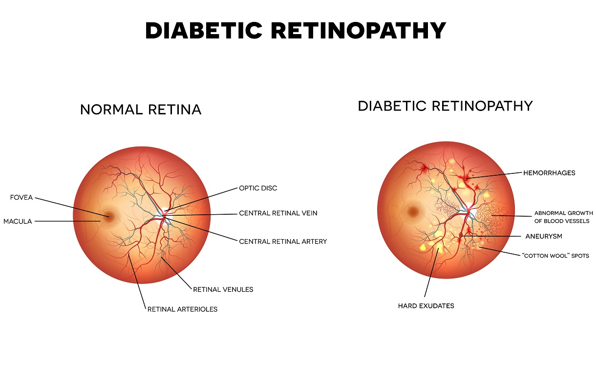

# Diabetic Retinopathy Detection in Digital Fundus Images

**AIM:** The aim of this project was to develop an automatic system that could analyse digital color retina images to detect signs of diabetic retinopathy.

**Method:** The process for automatic detection of diabetic retinopathy described here involves three parts.
1. Localizing the optic disc and blood vessel extraction.
2. Detecting exudates and red lesions (microaneurysms & hemorrhages).
3. Classification of images based on extracted features.

## 1.1 Blood vessel extraction
The algorithm for extracting the blood vessels is given below:
1. The green channel provides the best contrast between the optic disc and the background, therefore the green channel of the retina image is used. The contrast of the green channel is further enhanced.
2. A median filter of size 25 is used on this image. The contrast enhanced image is then subtracted from the resulting image. 
3. The image is then converted to binary by thresholding and then the resulting image is strengthened.
4. The largest connected component of this image, which is the blood vessel, is extracted from the image.

## 1.2 Localizing the optic disk
The process for extracting the optic disc take significant inspiration from [2]. The algorithm for performing optic disk localization is given by the following steps:
1. The green channel provides the best contrast between the optic disc and the background, therefore the green channel of the retina image is used. The contrast of the green channel is further enhanced.
2. The image is converted to binary by thresholding at 0.02% of the maximum image intensity value. The image is then eroded and then dilated with a disk 7 structure to remove unwanted noise.
3. The remaining components are filtered based upon their roundness and size. Components that are too small or irregularly shaped are removed.
4. The center of the component that has the most blood vessel activity around it is chosen as the optic disc center. The blood vessel image generated in 1.1 is used from this step.
5. The center point is then dilated with a disk structure of size 80.
6. The detected region of the original green channel is morphologically reconstructed.
7. The resulting image is then subtracted from the original green channel image and is then binarized by thresholding.
8. A median filter is used to remove noise and morphological dilation is performed.

## 2.1 Exudate detection
Two methods are used to detect exudates. One using a logarithmic function and the other using the mean-shift algorithm. Each of the two test cases fail to detect the exudates in some cases and are hence combined to extract the exudates. 

### 2.1.1 Exudate detection using a log function
This process is based entirely upon [2]. The steps are as follows:
1. The contrast of the green channel of the retina image is enhanced. The green channel provides the best contrast between the exudates and the rest of the image.
2. The obtained image is exposed to logarithm function of various bases in order to further emphasize the exudates.

3. The image is binarized by setting the pixels having maximum intensity to 1 and making the rest of the pixels be 0.
4. The detected optic disk (1.2) is then removed for the resulting image.

### 2.1.2 Exudate detection using mean-shift
The following steps describe the algorithm used to extract the exudates using mean shift:
1. Increase the contrast of the retina image.
2. Run the mean-shift algorithms to segment the exudates and the background.

### 2.1.3 Combine results
The exudates extracted from the previous two methods are combined together to give an overall estimate of exudates in the retina image. The combination is done by considering only the overlapping exudate pixels in each method as the true exudates. The number of pixels covered by the exudates is then counted. This is used as the first feature in the classifier.

## 2.2 Red lesions detection
The red lesions (hemorrhages and microaneurysms)  are extracted using the following steps:
1. Increase the contrast of the green channel image.
2. Apply a median filter of size 25 on the image.
3. Subtract the original image from the median filtered image. 
4. Remove the blood vessels obtained using 1.1 from the resulting image.
5. Filter the image components by specifying the general parameters of red lesions.
6. Erode using a disk structure to remove noise.
7. Calculate the pixels covered by the red lesions. This is used as the second feature of the classifier.

## 3. Classification
Classification of images was done using a Discriminant Analysis classifier. The classifier was trained on a set of 36 images from the STARE Database. 18 of these were healthy and 18 were diseased. 

## 4. Results
6-fold cross validation using the training set gave the following results:
- Sensitivity: 0.9444
- Specificity: 0.9444
- F-score: 0.9444

Additionally, the trained classifier was used to predict the labels of 36 different images from the STARE database. Results are as follows:
- Sensitivity: 0.7778
- Specificity: 0.7222
- F-score: 0.7490

## 5. Areas of improvement
The results may improve through additional preprocessing steps to mainly remove the intensity gradient in the retina images. Furthermore, better extraction of the blood vessels would improve optic disc elimination and red lesion detection. Finally, extraction of “cotton-wool” spots and abnormal vessel growth would help in better classification of unhealthy retina images.

## References:
[1] Diabetic Retinopathy. (n.d.). Retrieved from http://wjscottmd.com/diabetic-retinopathy/

[2] Zeljković, V., Bojic, M., Zhao, S., Tameze, C., & Valev, V. (2014). Exudates and optic disk detection in retinal images of diabetic patients. Concurrency and Computation: Practice and Experience, 27(1), 172-192. doi:10.1002/cpe.3215

